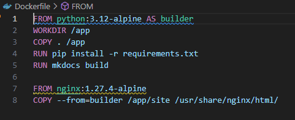

# Dockerización de MKDocs
Con docker podemos crear un contenedor y hacer que todo lo que se necesita para ejecutar una aplicación, un servidor, etc... se haga todo a la vez, aislado y siempre funcional ya que tendrá siempre las mismas versiones. Esto se puede hacer al gusto, con un dockerfile podemos establecer qué queremos que haga el contenedor al construirse. Hasta ahora, de forma local, he estado ejecutando MKdocs en local con el comando serve desde el propio Visual Code. Ahora vamos a hacerlo con Docker.

### Creando el Dockerfile
Para empezar, necesitamos el Dockerfile que establecerá las configuraciones que queremos para nuestro MKdocs. Esto creará el entorno para poder ejecutarla, así que aquí podemos establecer los puertos que usará, que se instale con Python, etc... Este es el dockerfile que he usado para este caso:



Este dockerfile está conformado por dos capas, vayamos paso a paso... 

```bash
FROM python:3.12-alpine AS builder
```

La primera línea es donde además empieza la primera capa. Este comando, FROM, es la imagen que se elige para construir esta capa. La elegida es una imagen de un python, ya que como sabemos MKdocs funciona con python y se instala a través de este. La segunda parte del comando "AS builder" es un alias que se le da a la capa del contenedor. Le llamamos builder por su papel en este dockerfile, ya que la primera capa servirá de base para la segunda.

```bash
WORKDIR /app
```

Lo siguiente es crear un directorio de trabajo, que está en la raíz y de nombre es "app". La manera para entenderlo por mi parte, es imaginar que cada contenedor es como una carpeta raiz, donde dentro se pueden depositar las cosas que necesitemos. Y así es.

```bash
COPY . /app
```

Una vez tenemos el directorio /app, vamos a copiar todo el contenido de nuestro MKdocs dentro de esta. Como vemos, es un "COPY ." así que copiará todo lo que haya en la carpeta del archivo dockerfile. Tenemos que dejar el dockerfile con todos los archivos que forman parte del MKdocs desde la raíz. Como se puede ver en mi [repositorio del proyecto](https://github.com/AlvaroGarOca/PrimerMKdocs)

```bash
RUN pip install -r requirements.txt
```

El archivo requirements.txt ya sabemos lo que es, pues con este comando instalamos todo lo que hay dentro de este con pip, al ser un contenedor python podemos usar pip sin problema. Recordemos que dentro de requirements está lo primero MKdocs con su versión.

```bash
RUN mkdocs build
```

Compilamos todo para crear el site de nuestro proyecto.

```bash
FROM nginx:1.27.4-alpine
```

Comienza la segunda capa. Ahora construimos la segunda capa con una imagen de un nginx, que como sabemos, es un servidor web.

```bash
COPY --from=builder /app/site /usr/share/nginx/html/
```

Y por útimo, copiamos desde el builder (la primera capa) la carpeta site que se creó. Esta carpeta la llevamos a la última ruta que se ve en el comando, que es donde se alojan los sitios que queremos mostrar en nuestro Nginx. Y con esto hecho, ya tenemos nuestro dockerfile listo para usarlo.

### Crear la imagen

Ahora que ya tenemos las instrucciones para nuestra imagen, vamos a crearla. Para hacerlo, simplemente hay que ejecutar el siguiente comando:

```bash
docker build -t mkdocs:1.0.0 .
```

Como vemos, hay un punto al final, así que hay que ejecutar este comando desde la carpeta de nuestro proyecto, donde se encuentra el dockerfile.

### Levantar el contenedor

Tras un minuto aproximadamente, tendremos nuestra imagen preparada. Ahora vamos a usarla para construir nuestro contenedor, que recordemos que tendrá un servidor web Nginx alojando nuestro proyecto MKdocs.


??? example "Comando"

    ``` bash
    docker run -p 8080:80 -d --name MKdocs mkdocs:1.0.0
    ```

Con docker run ejecutamos la imagen que queremos, los parametros son estos:

* -p 8080:80 sirve para vincular el puerto 80 del contenedor (que es el puerto por el que trabaja Nginx por defecto) a nuestro puerto 8080 de nuestra máquina real. Con esto podremos conectar a Nginx con localhost:8080
* -d sirve para lanzar en modo detach. Esto sirve para ejecutarlo en segundo plano y liberar la consola de comandos.
* --name MKdocs sirve para darle ese nombre a el contenedor.
* mkdocs:1.0.0 seleccionamos la imagen que hemos creado antes con nuestro dockerfile.

Ahora solo queda entrar a nuestro MKdocs a traves de localhost:8080


:material-party-popper::material-party-popper::material-party-popper: