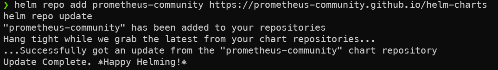
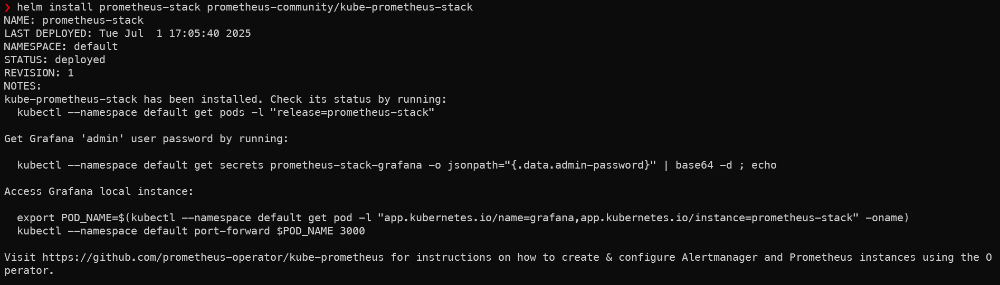
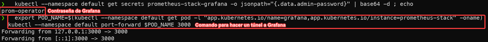
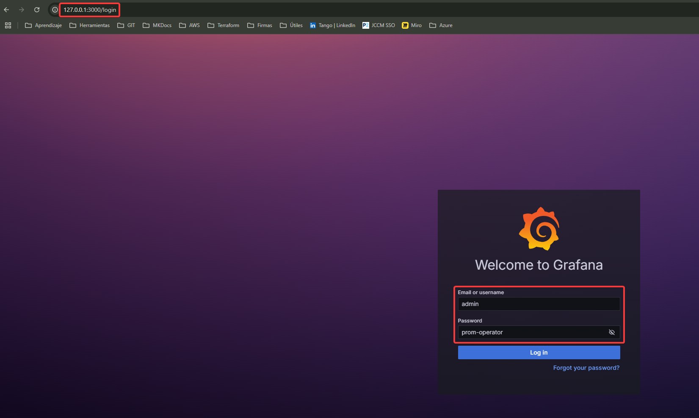

# Kubernetes con Helm
Con Helm, podemos instalar paquetes ya configurados y funcionales para usarlos directamente, ya sean hechos por nosotros mismos o públicos. Si visitamos [Artifact Hub](https://artifacthub.io/) podremos encontrar un repositorio de paquetes donde descargar cientos de aplicaciones o herramientas para nuestros proyectos de Kubernetes. Esto lo hace cómodo y rápido para incluir cosas nuevas a nuestros proyectos de Kubernetes. 

En esta práctica, vamos a probar cómo funciona tras la instalación básica. En la web de Helm, podemos encontrar una [guía de instalación](https://helm.sh/es/docs/intro/install/), que como verás es muy sencillo y es un momento. 

### Instalar kube-prometheus-stack
Vamos a instalar un paquete que es muy útil y que es muy popular en Artifact Hub. Con este paquete, vamos a instalar un Prometheus que trabajará con Grafana, además tiene algunas cosas más incorporadas, que nos permitirá de manera nativa ver por ejemplo estadisticas de nuestro Minikube dependiendo de los pods que tengamos levantados, etc...

Para ello vamos a [este enlace](https://artifacthub.io/packages/helm/prometheus-community/kube-prometheus-stack) para ver su documentación. En la web veremos la simpleza para descargar e instalar el repositorio. En estas imagenes muestro como es el proceso de descarga e instalación:

Primero añadimos el paquete al repositorio local de nuestro Helm, y lo actualizamos.

!!!warning "¡Recuerda!"
    Debes tener Minikube arrancado. Recomiendo hacer un Minikube delete y luego volverlo a arrancar para tenerlo limpio y que no haya ningún pod o servicio de otras prácticas arrancado.

Ahora que lo tenemos listo, ejecutamos el comando que se ve en la pantalla, donde "prometheus-stack" es el nombre que quiero darle, puedes poner el que quieras. Este paquete, como muchos otros, puede darte notas tras la instalación, en este caso te da por ejemplo un comando para comprobar el estatus del pod, y también como sacar la contraseña de Grafana para poder loguearte y trabajar con él. 

Ahora que lo tenemos instalado, nos fijamos en las instrucciones que nos da el paquete, como sacar la contraseña de Grafana y el comando para hacerle un túnel directo y poder conectar localmente.

Y ya podemos probar nuestro Grafana usando ambas cosas.

Veremos que es totalmente funcional y que en la parte de Dashboards ya tenemos unos cuantos creados, entre ellos para poder ver datos de nuestro Minikube. Felicidades, ya has usado Helm por primera vez, sencillo.