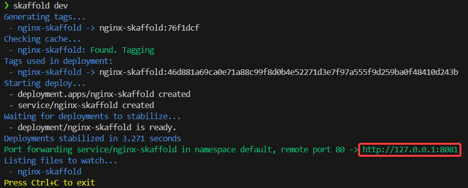

# Trabajar con Skaffold
Si ahora hiciesemos un cambio en la imagen, el contenido del HTML o lo que sea, entonces tendríamos que parar los pods manualmente, relanzarlos, etc. Con Skaffold, si hacemos un cambio en un archivo y lo guardamos, automáticamente se aplicará el cambio en local y podremos ver lo que hemos hecho sin tener que hacer nada más manualmente. 

Para eso vamos a hacer un cambio en nuestro proyecto. Antes lo hicimos con un configmap, pero esta vez vamos a montar el index en la imagen que usaremos para el pod. Esto es algo que realmente no es tan óptimo como lo hemos hecho antes, pero será más sencillo para hacerlo en local, ya que se aplicará lo que hace a Skaffold, ya que un cambio manual en el configmap no hace que se relance el pod como tal. Además, es rápido.

En este caso, como os imagináis, no vamos a usar el configmap, así que lo vamos a comentar entero para dejarlo guardado, pero no lo usaremos para esta práctica.

### Deployment
Este deployment es prácticamente idéntico al de la primera práctica, pero realmente es más simple aún que el otro, ya que prescindimos del volumen y el volumeMount, ya que ahora se instalará la imagen tal y como viene por defecto, los cambios que queremos aplicar se los haremos a la propia imagen. 

!!!note "Deployment"
    ```bash
    apiVersion: apps/v1
    kind: Deployment
    metadata:
    name: nginx-skaffold
    spec:
    replicas: 1
    selector:
        matchLabels:
        app: nginx-skaffold
    template:
        metadata:
        labels:
            app: nginx-skaffold
        spec:
        containers:
            - name: nginx
            image: nginx-skaffold  
            ports:
                - containerPort: 80
    ```

### Service
En cuanto al service, es prácticamente igual que el de la práctica anterior, solo cambian los nombres.

!!!note "Service"
    ```bash
    apiVersion: v1
    kind: Service
    metadata:
    name: nginx-skaffold
    spec:
    type: NodePort
    selector:
        app: nginx-skaffold
    ports:
        - port: 80
        targetPort: 80
        nodePort: 30080
    ```

### Index.html
Crearemos un archivo HTML simple para añadir el contenido que queramos a la web. En la anterior lo hicimos con el configmap, así que lo aplicabamos una vez la imagen estuviese instalada. Ahora lo que haremos será aplicárselo a la imagen que vamos a instalar antes de hacerlo, así los cambios que hagamos al HTML se "aplicarán" a la imagen con cada cambio y en cuestión de segundos veremos estos cambios de manera práctica y más rápida. 

!!!note "Ejemplo de HTML"
    ```html
    <!DOCTYPE html>
    <html>
    <head>
    <title>Skaffold</title>
    </head>
    <body>
    <h1>Probando Skaffold</h1>
    </body>
    </html>
    ```

### Dockerfile
Como ya comenté al inicio, para esta práctica vamos a crear un Dockerfile extremadamente simple para crear nuestra propia imagen y así usarla para el proyecto. Lo que haremos será simplemente indicarle la imagen que queremos usar y despues copiarle el Index que acabamos de crear.

!!!note "Dockerfile"
    ```bash
    FROM nginx:alpine
    COPY html/index.html /usr/share/nginx/html/index.html
    ```

### Skaffold
Y llegamos a lo importante. Ahora vamos a crear el archivo Skaffold.yaml, donde le vamos a indicar al propio Skaffold las instrucciones que debe seguir para trabajar con él. Le vamos a poner la última versión disponible, y el tipo de archivo será Config. Para construirlo, le vamos a indicar la imagen y donde se encuentra (context), le decimos que usaremos docker para esa imagen y le damos el nombre de nuestro dockerfile. Los manifiestos son básicamente los archivos que conforman nuestro kubernetes, es decir, nuestro Deployment y Service en este caso. Le damos la carpeta donde están alojados y le decimos que queremos todos los archivos que hay detrás de esa carpeta. 

Por último, le damos el portForward para que use el 8080 y así asegurarnos que no usa un puerto que ya estemos usando. Antes de eso, le decimos que trabajará con Kubectl, ya que es lo que estamos usando nosotros.

!!!note "Skaffold.yaml"
    ```bash
    apiVersion: skaffold/v4beta6
    kind: Config
    metadata:
    name: nginx-skaffold
    build:
    artifacts:
        - image: nginx-skaffold
        context: .
        docker:
            dockerfile: Dockerfile
    local:
        push: false
    manifests:
    rawYaml:
        - k8s/*
    deploy:
    kubectl: {}
    portForward:
    - resourceType: service
        resourceName: nginx-skaffold
        port: 80
        localPort: 8080
    ```

Ahora que ya lo tenemos todo, vamos a lanzarlo. Para trabajar con Skaffold, primero debemos asegurarnos que tenemos arrancado Docker y Minikube iniciado. Cuando lo tenemos, simplemente vamos a usar Skaffold dev (Obviamente hay que tenerlo instalado previamente, es muy sencillo) y veremos en la consola de comandos que nos da la IP local en la que lo aloja. 



Si visitamos el enlace, veremos el HTML que le hemos dado. Ahora cada vez que hagamos un cambio en nuestro Index.html y guardemos el archivo, solo tenemos que recargar el navegador cuando acabe de reconstruir la imagen para ver los cambios. ¡Hecho!