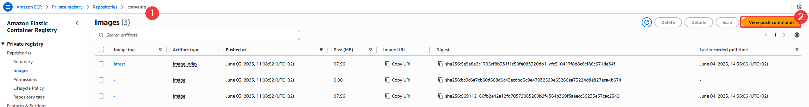
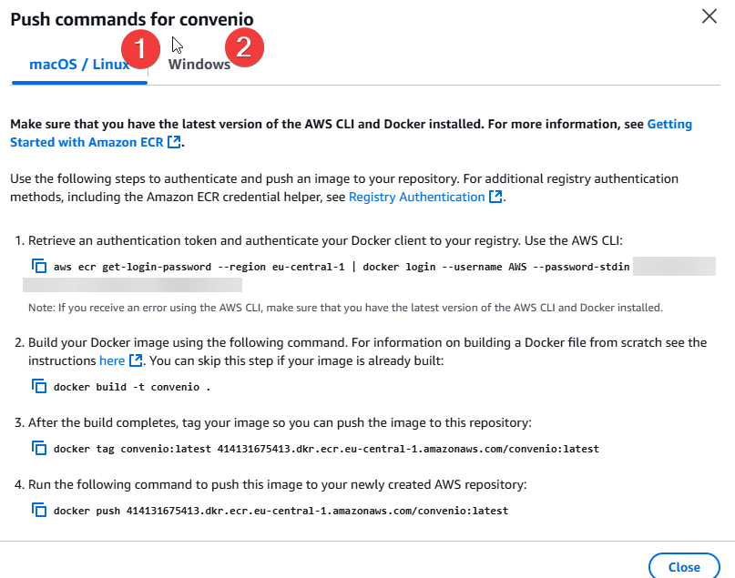

# Desplegar Bookstack con ECR y ECS
Esta práctica es similar a la de [Wordpress](TerraPrac3.md), ya que vamos a usar prácticamente todos los servicios que usamos ahí, pero con un par de añadidos y cambios.

Nos centraremos en los servicios, ya hemos visto el versions.tf en otros ejercicio y aquí no cambia.

### VPC
Esta VPC es exactamente la misma que hemos usado en otras prácticas.

```bash
    module "vpc" {
    source  = "terraform-aws-modules/vpc/aws"
    version = "5.21.0"

    name = "Conv_VPC"

    # Network
    cidr            = "10.0.0.0/16"
    azs             = ["eu-central-1a", "eu-central-1b", "eu-central-1c"] # Frankfurt
    private_subnets = ["10.0.1.0/24", "10.0.2.0/24", "10.0.3.0/24"]
    public_subnets  = ["10.0.101.0/24", "10.0.102.0/24", "10.0.103.0/24"]
    }
```

### Pares de llaves
Vamos a usar la misma manera que usamos en la práctica de Wordpress para crear el par de llaves, el cual usaremos para conectar a EC2 para hacer comprobaciones con la base de datos.

```bash
    resource "tls_private_key" "terrafrom_generated_private_key" {
    algorithm = "RSA"
    rsa_bits  = 4096
    }

    resource "aws_key_pair" "ssh-key" {
    key_name   = "server-key"
    public_key = tls_private_key.terrafrom_generated_private_key.public_key_openssh
    }

    resource "local_file" "cloud_pem" {
    filename        = "${path.module}/ec2_private_key.pem"
    content         = tls_private_key.terrafrom_generated_private_key.private_key_openssh
    file_permission = "0600"
    }
```

### ECR
Para esta práctica vamos a crear nuestra propia imagen (podemos coger un dockerfile de algún repositorio público) de Bookstack, pero lo alojaremos en el ECR y así tendremos la imagen disponible siempre que nos haga falta.

Aquí, le vamos a indicar que sea mutable, de lo contrario directamente tendremos problemas para subir nuestra imagen. Además, de que podremos subir imagenes y pisarlas sin problemas. Tenemos que darle acceso a nuestro usuario de la cuenta de AWS y también al rol de ejecución de tareas.

El resto de opciones las dejamos como os muestro, que es básicamente para guardar las últimas 30 imágenes.

```bash
    module "ecr" {
    source = "terraform-aws-modules/ecr/aws"

    repository_name                   = "convenio"
    repository_image_tag_mutability   = "MUTABLE"
    repository_read_write_access_arns = ["arn:aws:iam::414131675413:user/alvaro.garcia"]
    repository_read_access_arns       = ["arn:aws:iam::414131675413:role/ecsTaskExecutionRole"]
    repository_lifecycle_policy = jsonencode({
        rules = [
        {
            rulePriority = 1,
            description  = "Keep last 30 images",
            selection = {
            tagStatus     = "tagged",
            tagPrefixList = ["v"],
            countType     = "imageCountMoreThan",
            countNumber   = 30
            },
            action = {
            type = "expire"
            }
        }
        ]
    })

    tags = {
        Terraform   = "true"
        Environment = "dev"
    }
    }
```

### EC2
Vamos a crear el EC2 casi igual que en Wordpress. El único cambio que le vamos a hacer, es en el user data, que lo vamos a actualizar para esta práctica. Le vamos a crear una base de datos para Bookstack además del usuario.

```bash
    data "aws_ami" "latest_amazon_linux_image" {
    most_recent = true
    owners      = ["amazon"]
    filter {
        name   = "name"
        values = ["amzn2-ami-kernel-*-hvm-*-x86_64-gp2"]
    }
    filter {
        name   = "virtualization-type"
        values = ["hvm"]
    }
    }

    resource "aws_instance" "Conv_EC2" {
    ami = data.aws_ami.latest_amazon_linux_image.id

    instance_type               = "t2.micro"
    key_name                    = aws_key_pair.ssh-key.key_name
    vpc_security_group_ids      = [aws_security_group.ec2_sg.id]
    subnet_id                   = module.vpc.public_subnets[0]
    associate_public_ip_address = true

    user_data = <<-EOF
                #!/bin/bash
                yum update -y
                yum install -y mysql

                # Esperar a que el clúster RDS esté disponible
                sleep 320

                # Crear usuario en la base de datos
                mysql -h ${module.cluster.cluster_endpoint} -u admin -ppassword -e "CREATE DATABASE IF NOT EXISTS bookstack;"
                mysql -h ${module.cluster.cluster_endpoint} -u admin -ppassword -e "CREATE USER IF NOT EXISTS 'admin'@'%' IDENTIFIED BY 'password';"
                mysql -h ${module.cluster.cluster_endpoint} -u admin -ppassword -e "GRANT ALL PRIVILEGES ON bookstack.* TO 'admin'@'%' WITH GRANT OPTION;"
                mysql -h ${module.cluster.cluster_endpoint} -u admin -ppassword -e "FLUSH PRIVILEGES;"
                
                EOF
    }
```

### RDS
El RDS... ¡Exacto! Igual que en Wordpress. 

```bash
    module "cluster" {
    source = "terraform-aws-modules/rds-aurora/aws"

    name           = "test-aurora-mysql"
    engine         = "aurora-mysql"
    engine_version = "8.0.mysql_aurora.3.09.0"
    instance_class = "db.t4g.medium"
    instances = {
        one = {}
    }
    manage_master_user_password = false
    master_username             = "admin"
    master_password             = "password"

    vpc_id                 = module.vpc.vpc_id
    db_subnet_group_name   = "aurora-subnet-group"
    create_db_subnet_group = true
    subnets                = module.vpc.private_subnets
    vpc_security_group_ids = [aws_security_group.rds_sg.id]

    storage_encrypted               = true
    apply_immediately               = true
    skip_final_snapshot             = true
    enabled_cloudwatch_logs_exports = []

    tags = {
        Environment = "dev"
        Terraform   = "true"
    }
    }
```

### Secrets Manager
En el Secrets Manager vamos a añadir los secretos que necesitaremos para Bookstack concretamente. Aquí viene algo más complejo, y es que para que Bookstack funcione hay que añadirle dos campos que funcionan de manera diferente a lo que hemos estado viendo. 

El primero es APP_URL, aquí le tenemos que indicar el balanceador que vamos a crear más adelante, con http delante para que lo tome como un enlace web. Esta es la URL que se le asignará directamente a Bookstack.

Luego está APP_KEY, que es una llave que tenemos que sacar del contenedor Docker, una variable de entorno que forma parte del framework en el que trabaja Bookstack, encripta y desencripta datos para asegurar la integridad de estos. ¿Cómo se obtiene esta llave? Con el siguiente comando:

```bash "Comando para sacar la APP_KEY"
docker run -it --rm --entrypoint /bin/bash lscr.io/linuxserver/bookstack:latest appkey
```

```bash
    module "secrets_manager_bookstack" {
    source  = "terraform-aws-modules/secrets-manager/aws"
    version = "1.3.1"

    name                    = "bookstack-credentials"
    description             = "Credenciales para BookStack ECS"
    recovery_window_in_days = 0

    # Permite acceso al secreto desde ECS
    create_policy       = true
    block_public_policy = true
    policy_statements = {
        ecs_read_access = {
        sid = "AllowEcsExecutionRoleToReadSecrets"
        principals = [{
            type        = "AWS"
            identifiers = ["arn:aws:iam::414131675413:role/ecsTaskExecutionRole"]
        }]
        actions   = ["secretsmanager:GetSecretValue"]
        resources = ["*"]
        }
    }

    secret_string = jsonencode({
        DB_HOST       = module.cluster.cluster_endpoint
        DB_CONNECTION = "mysql"
        DB_DATABASE   = "bookstack"
        DB_USERNAME   = "admin"
        DB_PASSWORD   = "password"
        DB_PORT       = "3306"
        APP_URL       = "http://${aws_alb.application_load_balancer.dns_name}"
        APP_KEY       = "base64:pvkoVwIFFNIlrSv64B1OxBZRle0v8xxFHWY56wTVF3M="
    })

    tags = {
        Environment = "dev"
        Terraform   = "true"
    }
    }
```

### Security Groups
No hay mucho que decir aquí, ya que el propio código dice cómo y qué hace.

```bash
    # Security Group para permitir tráfico HTTP
    resource "aws_security_group" "bookstack_sg" {
    name        = "bookstack-sg"
    description = "Allow HTTP"
    vpc_id      = module.vpc.vpc_id

    ingress {
        from_port   = 80
        to_port     = 80
        protocol    = "tcp"
        cidr_blocks = ["0.0.0.0/0"]
    }

    egress {
        from_port   = 0
        to_port     = 0
        protocol    = "-1"
        cidr_blocks = ["0.0.0.0/0"]
    }
    }

    # Security Group para el bastion EC2
    resource "aws_security_group" "ec2_sg" {
    name        = "ec2_sg"
    description = "Security group to allow HTTP and SSH access"
    vpc_id      = module.vpc.vpc_id

    ingress {
        from_port   = 22
        to_port     = 22
        protocol    = "tcp"
        cidr_blocks = var.ip_whitelist
    }

    egress {
        from_port   = 0
        to_port     = 0
        protocol    = "-1"
        cidr_blocks = ["0.0.0.0/0"]
    }

    tags = {
        Name = "ec2_sg"
    }
    }

    resource "aws_security_group" "rds_sg" {
    name   = "rds_sg"
    vpc_id = module.vpc.vpc_id

    ingress {
        from_port       = 3306
        to_port         = 3306
        protocol        = "tcp"
        security_groups = [aws_security_group.ec2_sg.id]
        description     = "Allow MySQL access from EC2"
    }

    ingress {
        from_port       = 3306
        to_port         = 3306
        protocol        = "tcp"
        security_groups = [aws_security_group.bookstack_sg.id]
        description     = "Allow ECS boockstack access"
    }

    egress {
        from_port   = 0
        to_port     = 0
        protocol    = "-1"
        cidr_blocks = ["0.0.0.0/0"]
    }
    }

    resource "aws_security_group" "alb_sg" {
    name   = "alb_sg"
    vpc_id = module.vpc.vpc_id

    ingress {
        from_port   = 80
        to_port     = 80
        protocol    = "tcp"
        cidr_blocks = ["0.0.0.0/0"]
    }

    ingress {
        from_port   = 443
        to_port     = 443
        protocol    = "tcp"
        cidr_blocks = ["0.0.0.0/0"]
    }

    egress {
        from_port   = 0
        to_port     = 0
        protocol    = "-1"
        cidr_blocks = ["0.0.0.0/0"]
    }
    }

    resource "aws_security_group" "bookstack_efs_sg" {
    name   = "bookstack-efs-sg"
    vpc_id = module.vpc.vpc_id

    ingress {
        from_port       = 2049
        to_port         = 2049
        protocol        = "tcp"
        security_groups = [aws_security_group.bookstack_sg.id] # ECS tasks
    }

    egress {
        from_port   = 0
        to_port     = 0
        protocol    = "-1"
        cidr_blocks = ["0.0.0.0/0"]
    }
    }
```

### EFS
Vaaaale me has pillado, he cogido parte del código de la práctica de Wordpress... es lo bueno que tiene Terraform, que se pueden reusar bloques de código. (No es pereza, es eficiencia, lo juro)

```bash
    resource "aws_efs_file_system" "bookstack" {
    creation_token = "bookstack-efs"
    encrypted      = true
    tags = {
        Name = "bookstack-efs"
    }
    }

    locals {
    private_subnet_map = {
        "az1" = module.vpc.private_subnets[0]
        "az2" = module.vpc.private_subnets[1]
        "az3" = module.vpc.private_subnets[2]
    }
    }

    resource "aws_efs_mount_target" "bookstack" {
    for_each = local.private_subnet_map

    file_system_id  = aws_efs_file_system.bookstack.id
    subnet_id       = each.value
    security_groups = [aws_security_group.bookstack_efs_sg.id]
    }
```

### ECS

#### Cluster
Para el ECS tenemos que adaptarlo a Bookstack. Primero creamos el cluster, que es muy sencillo.

```bash
    # Creating an ECS cluster
    resource "aws_ecs_cluster" "cluster" {
    name = "ecs_bookstack_convenio"

    setting {
        name  = "containerInsights"
        value = "enabled"
    }
    }
```
#### Task Definition

Y ahora, en la task definition, vamos a añadir una serie de cosas. Para empezar, la imagen que usaremos no lo haremos como en la práctica de Wordpress (¡POR FIN!) si no que vincularemos el ECR que hemos creado antes, referenciando a la imagen que hemos subido.

En el mapeo de puertos, usaremos el puerto 80, ya que en mi caso concreto (puede que vosotros uséis otra imagen) usé una imagen que instalaba Bookstack en un Nginx que trabajaba por HTTP en el puerto 80, así que ese es el puerto que usaré.

En el punto de montaje, le ponemos el EFS y en "ContainerPath" le damos la carpeta dedicada de Bookstack para alojar archivos persistentes, que es /config. 

Después le damos los secrets de nuestro Secrets Manager.

Y por último el volumen, que volvemos a referenciar a nuestro EFS y le decimos que el root directory será la propia raíz.

```bash
    # Creating an ECS task definition
    resource "aws_ecs_task_definition" "task" {
    family                   = "service"
    execution_role_arn       = "arn:aws:iam::414131675413:role/ecsTaskExecutionRole"
    network_mode             = "awsvpc"
    requires_compatibilities = ["FARGATE"]
    cpu                      = 512
    memory                   = 1024

    container_definitions = jsonencode([
        {
        name      = "bookstack"
        image     = "414131675413.dkr.ecr.eu-central-1.amazonaws.com/convenio:latest"
        cpu       = 0
        essential = true

        portMappings = [
            {
            containerPort = 80
            hostPort      = 80
            protocol      = "tcp"
            name          = "bookstack-80-tcp"
            appProtocol   = "http"
            }
        ]

        mountPoints = [
            {
            sourceVolume  = "bookstack"
            containerPath = "/config"
            readOnly      = false
            }
        ]

        secrets = [
            {
            name      = "DB_HOST"
            valueFrom = "${module.secrets_manager_bookstack.secret_arn}:DB_HOST::"
            },
            {
            name      = "DB_DATABASE"
            valueFrom = "${module.secrets_manager_bookstack.secret_arn}:DB_DATABASE::"
            },
            {
            name      = "DB_USERNAME"
            valueFrom = "${module.secrets_manager_bookstack.secret_arn}:DB_USERNAME::"
            },
            {
            name      = "DB_PASSWORD"
            valueFrom = "${module.secrets_manager_bookstack.secret_arn}:DB_PASSWORD::"
            },
            {
            name      = "DB_PORT"
            valueFrom = "${module.secrets_manager_bookstack.secret_arn}:DB_PORT::"
            },
            {
            name      = "DB_CONNECTION"
            valueFrom = "${module.secrets_manager_bookstack.secret_arn}:DB_CONNECTION::"
            },
            {
            name      = "APP_URL"
            valueFrom = "${module.secrets_manager_bookstack.secret_arn}:APP_URL::"
            },
            {
            name      = "APP_KEY"
            valueFrom = "${module.secrets_manager_bookstack.secret_arn}:APP_KEY::"
            }
        ]

        logConfiguration = {
            logDriver = "awslogs"
            options = {
            awslogs-group         = "/ecs/bookstack-convenio"
            awslogs-region        = "eu-central-1"
            awslogs-stream-prefix = "ecs"
            }
        }
        }
    ])


    volume {
        name = "bookstack"

        efs_volume_configuration {
        file_system_id = aws_efs_file_system.bookstack.id

        root_directory = "/"

        transit_encryption = "ENABLED"

        authorization_config {
            access_point_id = null
            iam             = "DISABLED"
        }
        }
    }
    }
```

#### Service

En el servicio, la mayor diferencia es que tenemos que incorporar un load balancer. Aquí vamos a referenciar al target group (que crearemos a continuación), el nombre del contenedor y el puerto que usa. El resto de opciones las dejamos igual, ya que son opciones que hemos visto anteriormente.

```bash
    # Creating an ECS service
    resource "aws_ecs_service" "service" {
    depends_on       = [aws_lb_listener.listener]
    name             = "service_conv"
    cluster          = aws_ecs_cluster.cluster.id
    task_definition  = aws_ecs_task_definition.task.arn
    desired_count    = 1
    launch_type      = "FARGATE"
    platform_version = "LATEST"

    load_balancer {
        target_group_arn = aws_lb_target_group.target_group.arn
        container_name   = "bookstack"
        container_port   = 80
    }

    network_configuration {
        assign_public_ip = true
        security_groups  = [aws_security_group.bookstack_sg.id]
        subnets          = module.vpc.public_subnets
    }

    lifecycle {
        ignore_changes = [task_definition]
    }

    tags = {
        serviceName = "service_conv"
    }
    }
```

!!!note "¿Por qué hay que usar ALB?"
    En esta práctica vamos a necesitar un ALB para poder acceder a la web de Bookstack. Como vimos en el Secrets Manager, tuvimos que poner un parámetro APP_URL, que será la URL por la que trabajará Bookstack. Si entrase directamente por el url de la Task Definition, sería imposible decirle a Terraform que le de la IP de esta al Secrets Manager, ya que se creará después de Terraform y no hay manera de darle esa información.

    Otra solución podría ser usar un Route 53 y crearle un registro, pero aún así sería darle muchas vueltas. Lo más sencillo es crear un ALB, ya que nos asegura que siempre será el mismo punto de acceso si le damos la referencia de este en vez de una IP. 

    En resumen, lo necesitamos para poder tener siempre una URL concreta que se le pueda asignar al proyecto de Terraform y que Bookstack la use con seguridad.

### ALB
Creamos el ALB con un recurso, le damos tipo aplicación y le asignamos las subnets de nuestra VPC, además del security group que le creamos más arriba.

```bash
    #Defining the Application Load Balancer
    resource "aws_alb" "application_load_balancer" {
    name               = "bookstack-alb"
    internal           = false
    load_balancer_type = "application"
    subnets            = module.vpc.public_subnets
    security_groups    = [aws_security_group.alb_sg.id]
    }
```

#### Target Group
El Target Group sirve para lo que su propio nombre indica, trabajará por el puerto 80 y será de tipo IP. Otro punto importante aquí es el health check. El path concreto para Bookstack es /status, si no ponemos esto la web dará problemas ya que ALB funcionará con health check y si este falla, la task se cerrará directamente para volver a intentar levantarse de nuevo, así hasta que el health check de un visto bueno (Reciba un código 200(OK)). Le indicamos también que el puerto es el traffic-port, básicamente usará el 80, como le pusimos más arriba.

```bash
    #Defining the target group and a health check on the application
    resource "aws_lb_target_group" "target_group" {
    name        = "bookstack-tg"
    port        = 80
    protocol    = "HTTP"
    target_type = "ip"
    vpc_id      = module.vpc.vpc_id
    health_check {
        path                = "/status"
        protocol            = "HTTP"
        matcher             = "200"
        port                = "traffic-port"
        healthy_threshold   = 2
        unhealthy_threshold = 2
        timeout             = 10
        interval            = 30
    }
    }
```

#### Listener
Para gestionar el tráfico del ALB vamos a necesitar un listener, que escuchará las conexiones que llegan al ALB y decidirá a qué Target Group van. En este caso solo tenemos uno, pero es necesario tenerlo.

```bash
    #Defines an HTTP Listener for the ALB
    resource "aws_lb_listener" "listener" {
    load_balancer_arn = aws_alb.application_load_balancer.arn
    port              = "80"
    protocol          = "HTTP"

    default_action {
        type             = "forward"
        target_group_arn = aws_lb_target_group.target_group.arn
    }
    }
```

Con esto, ya tenemos todo lo que se refiere a Terraform. Nuestro proyecto está casi listo.

### Subir una imagen a ECR
Lo primero es ir al repositorio de ECR que tenemos creado, y a la derecha veremos un botón que dice "View push commands"



Al darle, ahí veremos los comandos que tenemos que ejecutar en nuestra terminal local, donde nos loguearemos con nuestra cuenta de AWS y después podremos hacer el resto de comandos para ponerle un tag a la imagen y subirla.



Después de lanzar esos comandos, ya tendremos la imagen Docker en nuestro ECR, lista para usar para el resto de nuestra infraestructura terraformada.